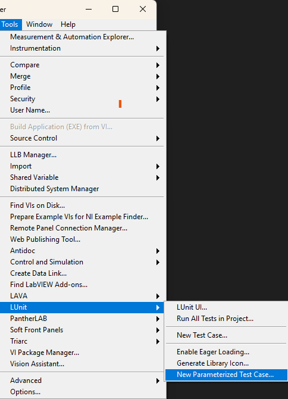
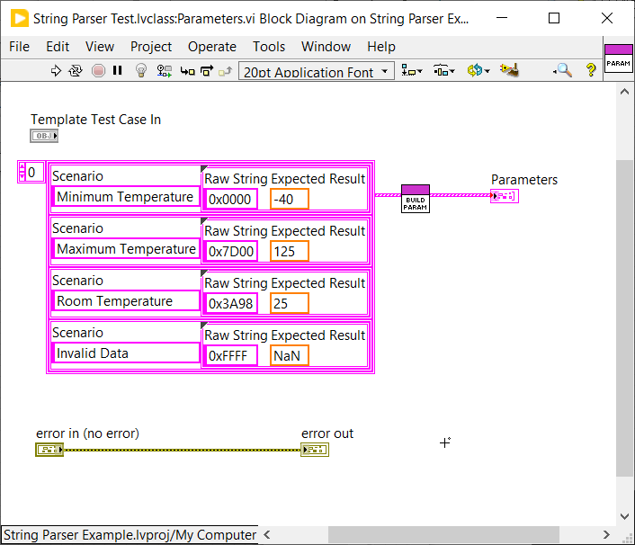

# LUnit Parameterized Test Add-on

This project contains a small add-on to LUnit for creating parameterized tests. 
Parameterization is useful when you need to test the same functionality using a set of different inputs and expected results. 
Using the Parameterized Test Case, this can be done in a way which minimizes code duplication and provides a starting point for developing these types of tests. 

## Installation

The add-on is installed using the vip-file under the releases section of this repository.
LabVIEW 2020 or newer versions are supported.

## Writing a Parameterized Test

To get started, let us look at an example. 
Let's assume we want to test conversion of some adc value from a temperature sensor. 
We could know the following possible values:

| Raw data | Temperature [degC] |
| ------------- | ------------- |
| 0x0000  | -40.0  |
| 0x7D00   | 125.0  |
| 0x3A98   | 25.0  |
| 0xFFFF   | Error |

Now we could write four different tests to test each value. 
However, using the Parameterized Test Case, we may write one test and define four parameter sets to test against.
We start by creating a new Parameterized Test Case from the Tools menu option

Now, we got the following test case to work from.

We add the data to the `String Parser Test.lvclass` class private data 

and declared in the `Parameters.vi`.
In this VI, each parameter is a cluster with a string called `Name` and an object of the type of the `String Parser Test.lvclass`.

We have still not written the actual test, so let's do that next.
We now need to write the test once, with the parameters taken from teh private data of the class. 

When executed by LUnit, this method will be run four times, once for each parameter.
LUnit will report the results for each parameter under the test case name in the UI.

And of course the results will turn green once the parser is implemented.